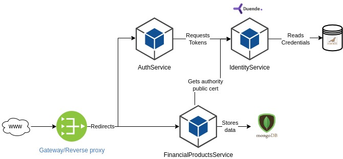

# FinancialMonkey

If monkeys can throw darts, they can invest. This project is a system for managing financial products as administrators and registering investments wallets as customers.

## Architecture

Following is a digram that illustrates the whole picture.

Internet traffic reaches an API Gateway or reverse proxy as a common entrypoint. This common entrypoint routes/redirects requests to the responsible service. Services are:

- **IdentityService**: a web API that uses [DuendeSoftware IdentityServer](https://duendesoftware.com/products/identityserver) to perform authentication of users and services. It signs and issues JWT tokens that are used as the main authorization mechanism elsewhere in the system. To store credentials a MariaDB SQL database is used.
- **AuthService**: a web API that is used as an authentication BFF to hide and abstract client credentials from users requesting tokens. It requests the IdentityService for tokens. Both admin and customer users use this web API to get an auth token.
- **FinancialProductsService**: this is the core service, is used by admins and customers. Customers can list financial products that are available to their profile, get more info about a product, register purchases and sell of financial products and get their wallet status.

## Running

The project is not finished yet, the docker-compose version is on its way.

### Running locally

Requirements:

- .NET 8 SDK and dotnet-ef;
- A MariaDb instance;
- A MongoDb instance;

The versioned appsettings are configured for the following configuration (the network ports must be free in the host machine):

- IdentityServer runnin on port 50001;
- AuthService running on port 5096;
- FinancialProductsService running on port 5196;
- MariaDb running on port 33306 with user root and password pwd and a database named financial_monkey_idserver;
- MongoDb running on port 9017 with root user mongoadmin and password pwd;
